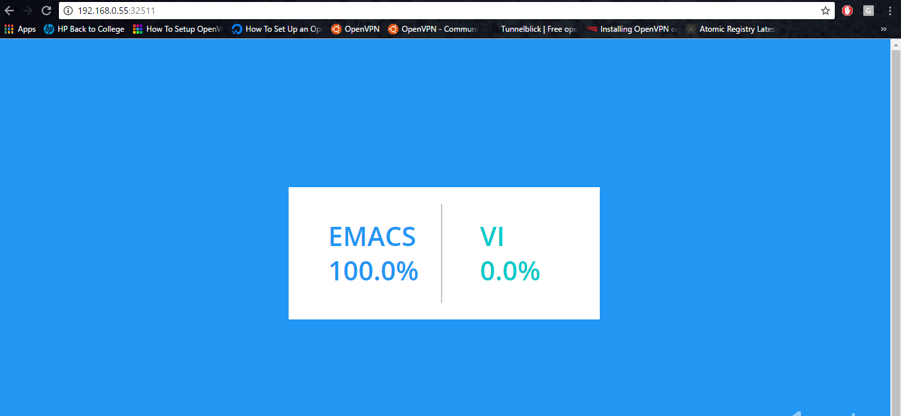

# Mini Project: Deploying Multi Tier Application Stack

In this project , you would write definitions for deploying the vote application stack with all components/tiers which include,

  * vote
  * redis
  * worker
  * db
  * result

## Project Description

  * Apply the deployment and service code for the applications marked as ready
  * Complete the code for  deployments and services marked as TODO
  * Apply the definitions that you have completed
  * Validate the application workflow is operational by loading vote and result applications from the browser


Following table depicts the state of readiness of the above services.

| App     | Deployment     | Service |
| :------------- | :------------- | :------------- |
| vote       | ready       | ready       |
| redis       | ready       | ready       |
| worker       | TODO       | n/a       |
| db       | ready       | ready       |
| result       | TODO       | TODO       |


### Apply existing code

```
git clone https://github.com/devopsfoo/k8s-code.git

cd k8s-code/projects/instavote/dev/

kubectl create namespace instavote

kubectl config set-context --current --namespace=instavote

kubectl apply -f vote-rs.yaml -f vote-svc.yaml
kubectl apply -f redis-deploy.yaml -f redis-svc.yaml
kubectl apply -f db-deploy.yaml -f db-svc.yaml
```

validate

```
kubectl get all
```
Where you should see,

  * replicaset and service for vote app created
  * deployments and services for redis and db created

If you see the above objects, proceed with the next task.

### Completing Code for worker and result apps

You would find the files available in the same directory as above i.e. *k8s-code/projects/instavote/dev/* with either partial or blank code. Your job is to complete the deployment and service yaml specs and apply those. While writing the specs, you could refer to the following specification.  

  * worker
    * image: schoolofdevops/worker:latest
  * results
    * image: schoolofdevops/vote-result
    * application port: 80
    * service type: NodePort


#### To Validate:

```
kubectl get all
```

The above command should show,
  * five deployments and four services created
  * services for vote and result app should have been exposed with NodePort

Find out the NodePort for vote and service apps and load those from your browser.


This is how the vote application should look like.



Above is how the result app should look like.

Final validation is, if you submit the vote, you should see the results changing accordingly. You would see this behavior only if all deployments and services are created and configured properly.
